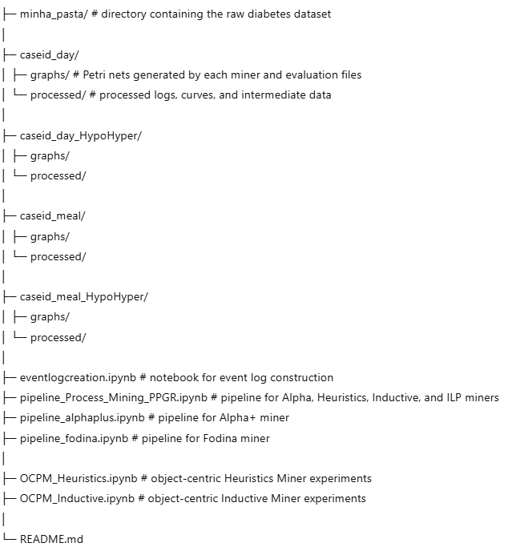

# "Extracting models of dynamic human health behaviour from real-life personal health data" - code

## Intro

Here, we have the code section of the usage of process discovery techniques to see which ones perform the best in conditions that can describe the human behaviour, specially during ...

## Repository structure

## Standard Process Mining

### minha_pasta

This is the folder where we have the database of the diabetes dataset "Longitudinal Multimodal Dataset of Type 1 Diabetes" (https://www.nature.com/articles/s41597-025-05695-1)

### caseid_day

graphs -> The obtained Petri Nets form the test with Alpha Miner, Alpha+, Fodina, Heuristics Miner, ILP Miner, Inductive Miner, and a txt file with the evaluation metrics for each of the tradicional process mining techniques

processed -> The curves created with de data during the event log creation or each event

### caseid_day_HypoHyper

graphs -> The obtained Petri Nets form the test with Alpha Miner, Alpha+, Fodina, Heuristics Miner, ILP Miner, Inductive Miner, and a txt file with the evaluation metrics for each of the tradicional process mining techniques

processed -> The curves created with de data during the event log creation or each event

### caseid_meal

graphs -> The obtained Petri Nets form the test with Alpha Miner, Alpha+, Fodina, Heuristics Miner, ILP Miner, Inductive Miner, and a txt file with the evaluation metrics for each of the tradicional process mining techniques

processed -> The curves created with de data during the event log creation or each event

### caseid_meal_HypoHyper

graphs -> The obtained Petri Nets form the test with Alpha Miner, Alpha+, Fodina, Heuristics Miner, ILP Miner, Inductive Miner, and a txt file with the evaluation metrics for each of the tradicional process mining techniques

processed -> The curves created with de data during the event log creation or each event

### eventlogcreation.ipynb

Notebook for the creation of event logs. After the first adjustements, the creation for case ID day, case ID meal, case ID day with filter for hyperglycemia and hypoglycemia events and case ID meal with filter for hyperglycemia and hypoglycemia events

### pipeline_Process_Mining_PPGR.ipynb

Pipeline for the usage of Alpha Miner, Heuristics Miner, Inductive Miner and ILP Miner. To use the different case notions, just change it directly in the pipeline

### pipeline_alphaplus.ipynb

Pipeline for the usage of Alpha+. To use the different case notions, just change it directly in the pipeline

### pipeline_fodina.ipynb

Pipeline for the usage of Fodina Miner. To use the different case notions, just change it directly in the pipeline

## Object Centric Process Mining

### OCPM_Heuristics.ipynb and OCPM_Inductive.ipynb

Application and evaluation of OC-Heuristics Miner and OC-Inductive Miner to the data from the dataset

(other files and folders - examples and spare tests before the creation of the pipelines for the OC-Inductive and OC-Heuristics usage)

## Overview
This repository contains code, notebooks, and experimental results for applying process discovery techniques to real-life personal health data. The main objective is to extract and analyse models of dynamic human behaviour from the Longitudinal Multimodal Dataset of Type 1 Diabetes. The dataset is published in Nature Scientific Data and is available at:

https://www.nature.com/articles/s41597-025-05695-1

This work evaluates classical process discovery algorithms (Alpha Miner, Alpha+, Fodina Miner, Heuristics Miner, ILP Miner, and Inductive Miner) as well as object-centric process mining approaches (OC-Heuristics Miner and OC-Inductive Miner). The repository includes event log creation, preprocessing, model discovery, and quantitative evaluation of the discovered models.

## Event log creation
The notebook `eventlogcreation.ipynb` is responsible for transforming the raw dataset into event logs suitable for process mining. Different case notions are supported, including case identification by day and by meal. Additionally, filtered event logs focusing on hypoglycaemia and hyperglycaemia events are generated.

## Process mining pipelines
The notebooks `pipeline_Process_Mining_PPGR.ipynb`, `pipeline_alphaplus.ipynb`, and `pipeline_fodina.ipynb` implement the discovery pipelines for the selected process mining algorithms. Each pipeline allows the user to select the case notion at the beginning of the notebook. The discovered models are saved as Petri nets in the `graphs/` directories together with text files containing the evaluation metrics.

## Object-centric process mining
The notebooks `OCPM_Heuristics.ipynb` and `OCPM_Inductive.ipynb` apply object-centric process mining techniques to the same dataset. These approaches allow modelling interactions between multiple object types, such as patients, meals, and glucose measurements.

## Stored results
For each experiment, the repository stores the discovered Petri nets and evaluation metrics. The evaluation metrics include fitness, precision, generalization, and simplicity, enabling a quantitative comparison between different discovery techniques and case notions.

## Requirements
The experiments were conducted using Python 3.8 or later and JupyterLab. The main Python libraries used include pandas, numpy, pm4py, matplotlib, and object-centric process mining libraries such as ocpa. 

## Execution
To reproduce the experiments, first place the raw dataset files in the `minha_pasta/` directory. Then run the `eventlogcreation.ipynb` notebook to generate the event logs. After that, execute the desired process mining pipeline notebook, ensuring that the selected case notion matches the generated logs. For object-centric experiments, run the corresponding OCPM notebooks.

## Credits
Dataset: Longitudinal Multimodal Dataset of Type 1 Diabetes, Nature Scientific Data  
Author: [Afonso Sarmento Rodrigues]  
Affiliation: [University of Minho; Eindhoven University of Technology (TU/e)]

